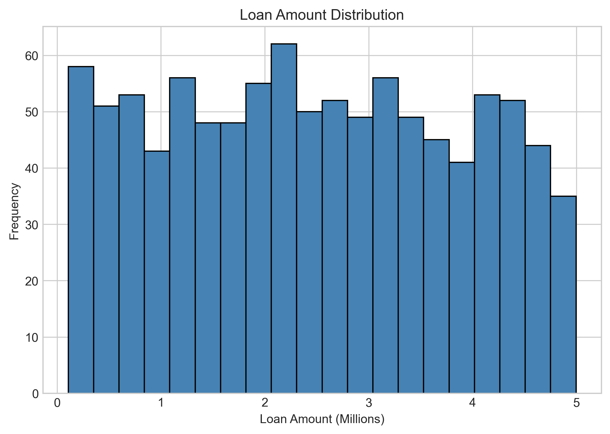
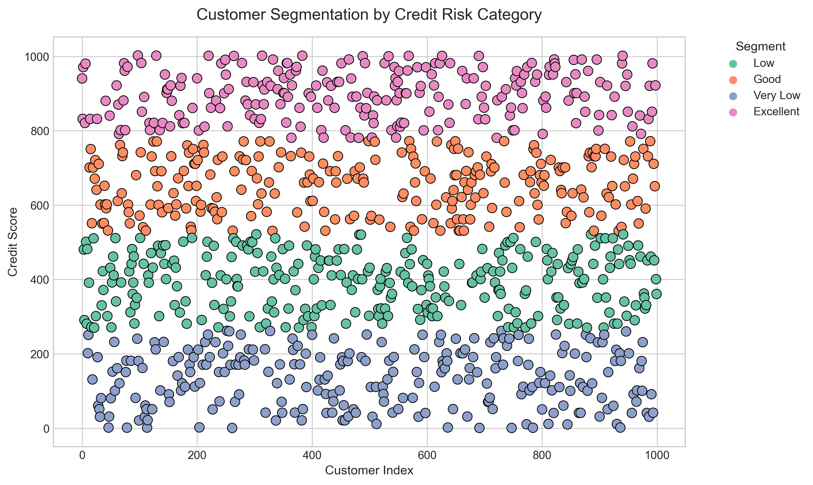

# Credit Risk Evaluation

## Project Overview
This project explores how borrower characteristics and financial behavior reflect different levels of creditworthiness.  
By examining both demographic and financial information, the analysis looks at how factors such as payment history, credit utilization, and loan amount influence overall credit performance.  

The process begins with understanding the dataset, calculating credit scores through a weighted scoring model, and then grouping borrowers using KMeans clustering.  
This approach provides a structured way to interpret how financial behavior translates into measurable credit reliability.  

Ultimately, the project aims to turn raw financial data into insight helping visualize how people borrow, repay, and manage credit risk across different levels of stability.

---

## Objectives
The main aim of this project is to understand what shapes a borrower’s credit reliability and how different factors interact to influence risk.  
To achieve this, the analysis focuses on exploring patterns in demographic and financial features such as age, employment, payment history, and credit usage to see how they reflect real-world borrowing behavior.  

It also aims to visualize these relationships clearly, uncovering trends that separate reliable borrowers from those with higher risk.  
Finally, by grouping borrowers into meaningful categories, the project provides a clearer view of how financial behavior can guide smarter and more confident lending decisions.

---

## Dataset
The dataset combines both demographic and financial details about borrowers, offering a full picture of who they are and how they manage credit.  
It includes attributes such as `Age`, `Gender`, `Education Level`, `Employment Status`, `Credit Utilization Ratio`, `Payment History`, `Number of Credit Accounts`, `Loan Amount`, `Interest Rate`, `Loan Term`, `Type of Loan`, and `Credit Score`.  

These features help uncover patterns behind borrowing behavior by showing how background and financial habits come together to influence repayment reliability.  
Demographic attributes provide context for understanding the borrower’s situation, while financial variables reveal how credit is used, managed, and repaid.  

A weighted scoring model was developed to calculate an overall credit score for each borrower.  
This model assigns different importance (weights) to key factors like payment history and credit utilization, giving more influence to behaviors that strongly affect credit risk.  
The result is a consistent score that represents each borrower’s financial health and helps compare risk levels before clustering them into segments.

---

## Visual Story of Borrowers

### 1. Loan Amount Distribution
  

The histogram shows a wide range of loan amounts, with most borrowers clustered around moderate values.  
This concentration suggests that average-sized loans are the most common, possibly reflecting standard lending practices for typical consumer loans.  
The smaller group at the higher end of the distribution represents borrowers taking larger loans, which may indicate greater credit access or higher borrowing needs, though income levels are not directly captured in this dataset.  

---

### 2. Credit Risk Segmentation
  

The segmentation chart illustrates how borrowers are grouped by overall credit performance into Very Low, Low, Good, and Excellent categories.  
Each segment reflects differences in repayment reliability and financial behavior.

Excellent borrowers tend to have strong payment histories and low credit utilization, showing high financial stability.  

Good borrowers manage credit well but may show occasional variation in utilization or payment timing.  

Low and Very Low borrowers display weaker repayment consistency or higher utilization, representing elevated credit risk.  

This segmentation highlights how patterns in financial data can separate dependable borrowers from those who may require stricter lending conditions or closer monitoring.

---

## Conclusion
This project demonstrates how analytical techniques can be applied to evaluate borrower creditworthiness and manage credit risk with greater precision.  
By calculating credit scores through a weighted scoring model and segmenting borrowers using KMeans clustering, the analysis provides a structured view of how financial behavior translates into measurable credit performance.  

The findings reveal four clear borrower segments: Very Low, Low, Good, and Excellent, representing distinct levels of financial reliability and repayment confidence.  
These categories highlight the value of data-driven methods in identifying risk profiles, optimizing lending decisions, and strengthening credit management strategies.  

Overall, the results show that data can effectively capture patterns of responsibility and risk, turning financial records into actionable insight and supporting smarter, more transparent lending decisions.
